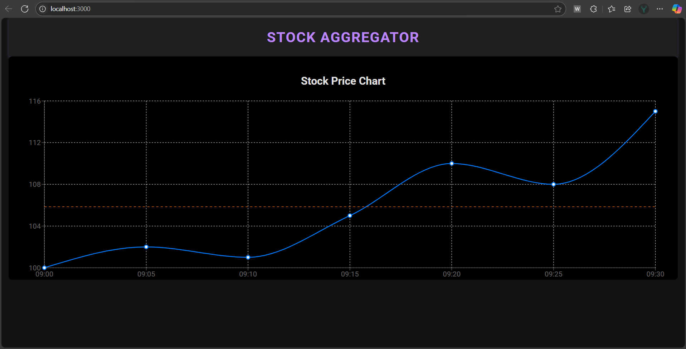
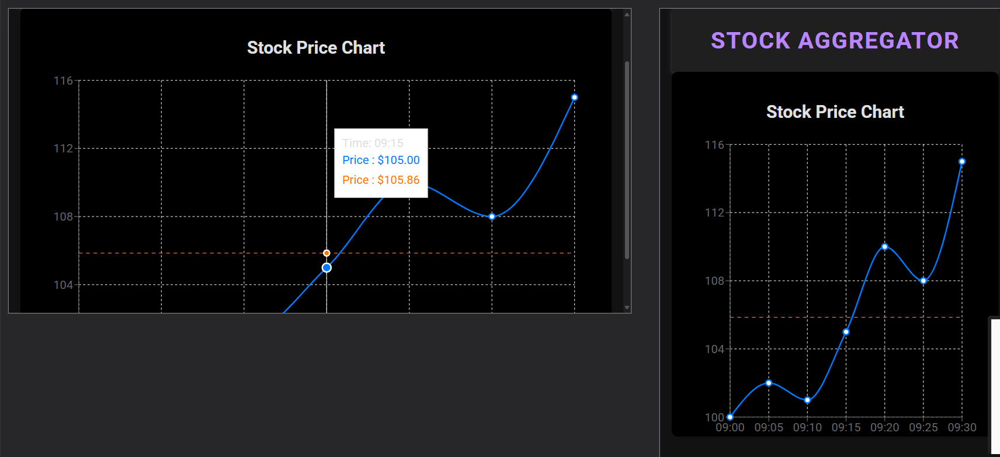
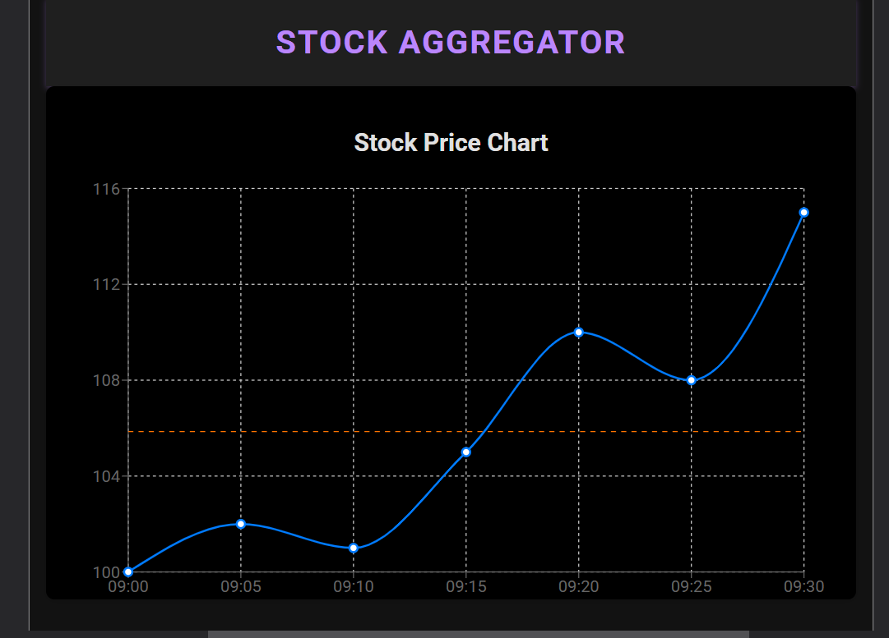

# Stock Aggregator

This is a React project that displays stock prices and their correlation data using charts and tables.

## Screenshots






##  Started

Clone the repository or download the project files.

Open your terminal and navigate to the project folder:

```bash
cd question-1-stock-aggregator
npm install
npm start

....
